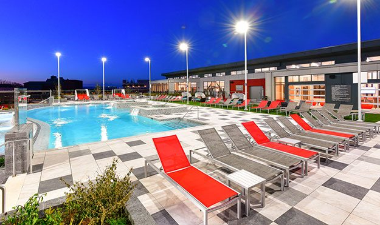

# Hyaat Hotel Website

As a collage midterm project we have been assigned to make a responsive Website by using HTML CSS & Bootstrap.

This documention outlines some of the major features, structure, and upgrades involved in the development process of the website for Hyatt Hotel. The website shall provide an aesthetically pleasant user interface for the users to choose their preferred accommodation type, amenities available within the hotel, room type options, food variety, and other essential services. In this report, the website structure, design options, and technical implementation, as well as recommendations for further enhancements, are explained.

## Lessons Learned

What did you learn while building this project?
=
i had to learn HTML,CSS and basic bootstrap

 What challenges did you face and how did you overcome them?
 =

 The main challenage was to make it responsive as i was beginner in bootstrap

## Appendix

HTML code with Bootstrap

<!DOCTYPE html>
<hmtl lang="en">
    <head>
        <meta charset="UTF-8"
        <meta name="viewport" content="width=device-device,initial-scale=1.0">
        <link href="https://stackpath.bootstrapcdn.com/bootstrap/4.5.2/css/bootstrap.min.css" rel="stylesheet">
        <link rel="stylesheet" href="style.css">

        <title> Hyatt Hotel</title>
    </head>
    <body>
        <header>
            <nav class="navbar navbar-expand-lg navbar-light bg-light">
                <button class="navbar-toggler" type="button" data-toggle="collapse" data-target="#navbarSupportedContent" aria-controls="navbarSupportedContent" aria-expanded="false" aria-label="Toggle navigation">
                  
                </button>
              
                

                  <ul class="navbar-nav">
                    <li class="nav-item active">
                      <a class="nav-link" href="#home">Home (current)</a>
                    </li>
                    <li class="nav-item">
                      <a class="nav-link" href="#rooms">Rooms</a>
                    </li>
                    <li class="nav-item">
                      <a class="nav-link" href="#Dining Option">Dining</a>
                    </li>
                    <li class="nav-item">
                      <a class="nav-link" href="#contact">Contact</a>
                    </li>
                    
                  </ul>
              </nav>
        </header>

    
</section>  <section id="Home">
    

        
        <h1 class="title">Hyatt Hotel</h1>
        
Experience luxury at its finest

        
    

</section>  
        
<section id="rooms">
    

      

        
        <h3>Single Rooms</h3>
        
      

      

        
        <h3>Double Rooms</h3>
       
      

      

        
        <h3>Queen Rooms</h3>
       
      

      

        
        <h3>Triple Rooms</h3>
        
      

      

        
        <h3>Deluxe Rooms</h3>
        
      

      

        
        <h3>Presidential Rooms</h3>
      

      

        
        <h3>Rooms with a View</h3>
      

    

  </section>
                  
                

        <section id="Dining Option">
            <h2>Dining Options</h2>
            

                

                    
                    <h3>Restaurant</h3>
                   
                

                

                    
                    <h3>Bar</h3>
                

                

                    
                    <h3>Bar</h3>
                

            

        </section>
         

        <section id="amenities">
            <h2>Amenities</h2>
            
We provide various amenities others than shown below such as transportation, no smoking-Zone and others

            

                

                    
                    <h3>Outdoor Pool</h3>
                   
                

                

                    
                    <h3>Fitness Center</h3>
                    
                

                

                    
                    <h3>Park</h3>
                   
                

                

                    
                    <h3>Tennis court</h3>
                    
                

                

                    
                    <h3>Spa Services</h3>
                   
                

                

                    
                    <h3>Conference room</h3>
                   
                

            

        </section>

        <section id="photo-gallery">
            <h2>Photo Gallery</h2>
            

                

                    
                

                

                    
                

                

                    
                

                

                    
                

                

                    
                

                

                    
                

                

                    
                

                

                    
                

                

                    
                

                

                    
                

                

                    
                

                
            

        </section>
        

        <section id="book now">
            

                <h2 class="mb-4">Book Your Stay</h2>
                

                    

                        <form>
                            

                                <label for="arrival-date">Arrival Date</label>
                                <input type="date" class="form-control" id="arrival-date" placeholder="MM-DD">
                            

                            
                            

                                <label for="room-type">Room Type</label>
                                <select class="form-control" id="room-type">
                                    <option value="">Select Room Type</option>
                                    <option value="single">Single Room</option>
                                    <option value="double">Double Room</option>
                                    <option value="queen">Queen Room</option>
                                    <option value="triple">Triple Room</option>
                                    <option value="deluxe">Deluxe Room</option>
                                    <option value="presidential">Presidential Room</option>
                                </select>
                            

                            

                                <label for="number-of-guests">Number of Guests</label>
                                <input type="number" class="form-control" id="number-of-guests" placeholder="1">
                            

                            <button type="submit" class="btn btn-primary">Book Now</button>
                        </form>
                    

                    
                

            

        </section>

        <section id="contact">
            <h2>Contact Us</h2>
            

                
Address:Boudha, Kathmandu, Bāgmatī, 44600

                
Phone: 015171243

                
Email: <a href="kathmandu.regency@hyatt.com">kathmandu.regency@hyatt.com</a> 

            

        </section>
    
        <footer class="footer">
            

                

                    

                        
Follow us on

                        
                        <ul class="list-inline social-links">
                            <li>
                                <a href="https://www.facebook.com/hyatt" class="footer-social-item Facebook" >
                                    
                                </a>
                            </li>
                            <li>
                                <a href="https://www.instagram.com/hyatt"  class="footer-social-item Instagram" >
                                    
                                </a>
                            </li>
                            <li>
                                <a href="https://x.com/Hyatt"  class="footer-social-item Twitter" >
                                    
                                </a>
                            </li>
                        </ul>
                    

                

            

        </footer>
        
    
    
    </body>
</hmtl>

CSS code

/* Global Styles */
body {
    font-family: Arial, sans-serif;
    line-height: 1.6;
    margin: 0;
    padding: 0;
    box-sizing: border-box;
}

/* Header */
header {
    background-color: #343a40;
    padding: 10px 0;
}

header nav ul {
    list-style: none;
    display: flex;
    justify-content: center;
    padding: 0;
    margin: 0;
}

header nav ul li {
    margin: 0 15px;
}

header nav ul li a {
    color: white;
    text-decoration: none;
    font-weight: bold;
}

header nav ul li a:hover {
    color: #007bff;
}

.hero-text {
    position: absolute;
    top: 50%;
    left: 50%;
    transform: translate(-50%, -50%);
    color: white;
    text-shadow: 2px 2px 8px rgba(0, 0, 0, 0.7);
    font-size: 48px;
    font-weight: bold;
    padding: 10px;
    background: rgba(0, 0, 0, 0.5); /* Optional: adds a background to the text */
    border-radius: 10px; /* Optional: rounds the corners of the background */
}
.subheading {
    text-align: center;
    font-size: 24px;
    margin-top: 10px;
    color: #333;
}

.navbar .active {
    font-weight: bold;
    color: #ff6347; /* Use a highlight color */
    border-bottom: 2px solid #ff6347; /* Adds a border to indicate active state */
}

.navbar a {
    font-weight: 600;
    padding: 10px 20px;
    text-decoration: none;
    color: #333;
}

.navbar a:hover {
    color: #ff6347;
}

/* Rooms Section */
#rooms {
    padding: 50px 0;
}

.rooms-Type {
    display: flex;
    flex-wrap: wrap;
    justify-content: center;
    gap: 20px;
}
.img-rounded{
    position: relative;
}
.title{
    position: absolute;
    display: flex;
    justify-content: center;
    align-items: center;
    top:400px;
    left:400px;
    font-weight: 700;
    font-size: 75px;
    color: white;
 
}
.room {
    flex: 1 1 300px;
    max-width: 300px;
    background: #f8f9fa;
    padding: 20px;
    border-radius: 10px;
    box-shadow: 0 4px 8px rgba(0, 0, 0, 0.1);
    text-align: center;
}

.room img {
    width: 100%;
    border-radius: 10px;
    margin-bottom: 15px;
}

.room h3 {
    font-size: 1.5rem;
    margin-bottom: 10px;
}

.room p {
    font-size: 1.1rem;
    color: #666;
}

/* Dining Section */
#dining {
    padding: 50px 0;
    background-color: #f8f9fa;
}

.dining-grid {
    display: flex;
    justify-content: space-around;
    flex-wrap: wrap;
    gap: 20px;
}

.dining-option {
    flex: 1 1 45%;
    max-width: 45%;
    text-align: center;
}

.dining-option img {
    width: 100%;
    border-radius: 10px;
    margin-bottom: 15px;
}

.dining-option h3 {
    font-size: 1.5rem;
    margin-bottom: 10px;
}

/* Amenities Section */
#amenities {
    padding: 50px 0;
}

.amenities-grid {
    display: flex;
    justify-content: space-around;
    flex-wrap: wrap;
    gap: 20px;
}

.amenity {
    flex: 1 1 30%;
    max-width: 30%;
    text-align: center;
}

.amenity img {
    width: 100%;
    border-radius: 10px;
    margin-bottom: 15px;
}

.amenity h3 {
    font-size: 1.5rem;
    margin-bottom: 10px;
}
/* Photo Gallery Section */
#photo-gallery {
    padding: 50px 0;
    background-color: #f8f9fa;
    text-align: center;
}

#photo-gallery h2 {
    margin-bottom: 30px;
    font-size: 2rem;
    color: #343a40;
}

.gallery-grid {
    display: grid;
    grid-template-columns: repeat(auto-fill, minmax(200px, 1fr));
    gap: 20px;
    justify-items: center;
}

.gallery-item img {
    width: 100%;
    border-radius: 10px;
    box-shadow: 0 4px 8px rgba(0, 0, 0, 0.1);
    transition: transform 0.2s;
}

.gallery-item img:hover {
    transform: scale(1.05);
}

/* Media Query for Smaller Screens */
@media (max-width: 600px) {
    .gallery-grid {
        grid-template-columns: repeat(auto-fill, minmax(150px, 1fr));
    }
}

/* Book Now Section */
#book-now {
    padding: 50px 0;
    background-color: #f8f9fa;
}

#book-now .container {
    max-width: 600px;
}

#book-now h2 {
    text-align: center;
    margin-bottom: 30px;
}

.form-group label {
    font-weight: bold;
}

/* Contact Section */
#contact {
    padding: 50px 0;
}

#contact .contact-info {
    text-align: center;
}

#contact .contact-info p {
    font-size: 1.1rem;
}

.footer {
    background-color: white; 
    padding: 20px 0; 
}

.social-links {
    list-style: none; 
    padding: 0; 
    margin: 0;
    display: flex;
    justify-content: center; 
}

.social-links li {
    margin: 0 10px;
}

.social-links img {
    display: block; 
}

## Screenshots

http://127.0.0.1:5500/
